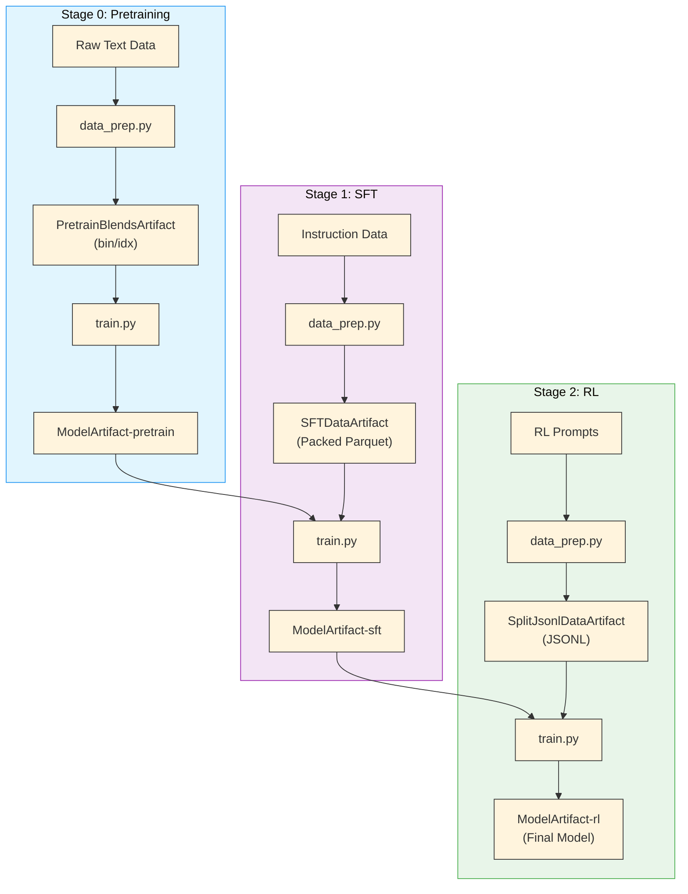

# Artifact Lineage & W&B Integration

The Nemotron training pipeline tracks lineage from raw data to final model through [Weights & Biases](./wandb.md) artifacts. Every data transformation and model checkpoint is versioned and linked, so you can trace any model back to its training data.

> **Note**: For full lineage tracking and team sharing, the artifact system uses [W&B](./wandb.md). A file-based backend is also available for local development—set `[artifacts] backend = "file"` in your `env.toml`. See [env.toml Reference](../nemo_runspec/nemo-run.md#envtoml-reference) for details.

## Why Lineage Matters

- **Reproducibility** – trace any model back to its exact training data and configuration
- **Debugging** – identify which data or training stage caused a regression
- **Compliance** – audit trail for model provenance and data usage
- **Collaboration** – share artifacts across teams with version control

## End-to-End Lineage

The training pipeline produces six artifact types across three stages:



## Artifact Naming

The artifact system uses three related concepts:

| Concept | Example | Where Used |
|---------|---------|------------|
| **Python class** | `PretrainBlendsArtifact` | Code imports (`from nemotron.kit import ...`) |
| **Registered name** | `PretrainBlendsArtifact-tiny` | W&B artifact names, `metadata.json` |
| **Config reference** | `PretrainBlendsArtifact-tiny:latest` | YAML configs (`run.data`), CLI overrides, `art://` URIs |

**How names are formed**: When the pipeline saves an artifact, it derives a name from the class name and the stage extracted from the semantic path (e.g., `PretrainBlendsArtifact` + `-tiny` from `nano3/tiny/data`). The `:latest` or `:v3` suffix is a W&B version tag.

**Stage aliases**: Shorthand aliases like `pretrain:latest`, `sft:latest` reference `ModelArtifact-<stage>:latest` in configs. Full names always work too.

## Artifact Types

| Artifact | Stage | Format | Description |
|----------|-------|--------|-------------|
| `PretrainBlendsArtifact-<config>` | [0](./nano3/pretrain.md) | bin/idx | Tokenized pretraining data in Megatron format |
| `ModelArtifact-pretrain` | [0](./nano3/pretrain.md) | checkpoint | Base model after pretraining |
| `SFTDataArtifact-sft` | [1](./nano3/sft.md) | Packed Parquet | Packed SFT sequences with loss masks |
| `ModelArtifact-sft` | [1](./nano3/sft.md) | checkpoint | Instruction-tuned model |
| `SplitJsonlDataArtifact-rl` | [2](./nano3/rl.md) | JSONL | RL prompts for [NeMo-RL](./nvidia-stack.md#nemo-rl) |
| `ModelArtifact-rl` | [2](./nano3/rl.md) | checkpoint | Final aligned model |

## W&B Configuration

Configure W&B in your `env.toml`:

```toml
[wandb]
project = "nemotron"
entity = "YOUR-TEAM"
```

Authenticate before running:

```bash
wandb login
```

## Using Artifacts

### Semantic URIs

Reference artifacts by semantic URI in configs and CLI:

```
art://PretrainBlendsArtifact-tiny:latest    # Latest version
art://ModelArtifact-sft:v3                   # Specific version
art://ModelArtifact-rl:production            # Alias
```

### CLI Options

Override artifact inputs via [CLI](./cli.md#artifact-resolution) dotlist overrides:

```bash
# Use specific data artifact
uv run nemotron nano3 pretrain run.data=PretrainBlendsArtifact-tiny:v2

# Use imported model
uv run nemotron nano3 sft run.model=my-custom-pretrain:latest
```

### Config Resolvers

Reference artifact paths in YAML configs:

```yaml
run:
  data: PretrainBlendsArtifact-tiny:latest

recipe:
  per_split_data_args_path: ${art:data,path}/blend.json
```

The `${art:data,path}` resolver extracts the filesystem path from the artifact.

## Viewing Lineage in W&B

After running the pipeline, view lineage in the W&B UI:

1. Navigate to your project's **Artifacts** tab
2. Select any artifact (e.g., `ModelArtifact-rl`)
3. Click the **Graph** view to see upstream dependencies
4. Trace back through each stage to the original data sources

The lineage graph shows:
- Which data artifacts were used to train each model
- Which model checkpoints were inputs to each stage
- Version history and metadata for each artifact

## Importing External Assets

Import existing models or data into the artifact system:

### Model Import

```bash
# Import pretrain checkpoint
uv run nemotron nano3 model import pretrain /path/to/checkpoint --step 50000

# Import SFT checkpoint
uv run nemotron nano3 model import sft /path/to/sft_model --step 10000

# Import RL checkpoint
uv run nemotron nano3 model import rl /path/to/rl_model --step 5000
```

### Data Import

```bash
# Import pretrain data (path to blend.json)
uv run nemotron nano3 data import pretrain /path/to/blend.json

# Import SFT data (directory with blend.json)
uv run nemotron nano3 data import sft /path/to/sft_data/

# Import RL data (directory with manifest.json)
uv run nemotron nano3 data import rl /path/to/rl_data/
```

See [Importing Models & Data](./nano3/import.md) for detailed directory structures.

## Troubleshooting

### "Artifact not found"

- Verify `project` and `entity` in `env.toml` match where artifacts were created
- Check artifact name spelling and version tag
- Ensure you're authenticated: `wandb login`

### Version Resolution Issues

- Use explicit versions (`artifact:v3`) instead of `:latest` for reproducibility
- Check artifact aliases in W&B UI

### Missing Lineage Links

- Artifacts must be created by the pipeline to have automatic lineage
- Imported artifacts start a new lineage chain
- Manual uploads via W&B UI don't create lineage links

## Programmatic Access

Access artifacts programmatically via the kit module:

```python
from nemotron.kit import PretrainBlendsArtifact, ModelArtifact

# Load from semantic URI
data = PretrainBlendsArtifact.from_uri("art://PretrainBlendsArtifact-tiny:latest")
print(f"Data path: {data.path}")
print(f"Total tokens: {data.total_tokens}")

# Load model artifact
model = ModelArtifact.from_uri("art://ModelArtifact-sft:latest")
print(f"Training step: {model.step}")
print(f"Loss: {model.loss}")
```

For framework details, see [Nemotron Kit](./kit.md).

## Creating Custom Artifacts

Create custom artifact types by subclassing `Artifact`. Typed fields are automatically synced to `metadata.json` and available via the `${art:NAME,FIELD}` resolver in configs.

### Basic Pattern

```python
from pathlib import Path
from typing import Annotated
from pydantic import Field
from nemotron.kit.artifacts.base import Artifact


class MyDataArtifact(Artifact):
    """Custom data artifact with typed metadata."""

    # Typed fields become metadata - accessible via ${art:data,num_samples}
    num_samples: Annotated[int, Field(ge=0, description="Number of samples")]
    source_url: Annotated[str | None, Field(default=None, description="Data source")]
    compression: Annotated[str, Field(default="none", description="Compression type")]
```

### Saving Artifacts

```python
# Create artifact pointing to output directory
artifact = MyDataArtifact(
    path=Path("/output/my_data"),
    num_samples=10000,
    source_url="https://example.com/data.tar.gz",
)

# Save metadata.json and publish to W&B (if configured)
artifact.save(name="MyDataArtifact-custom")
```

### Loading Artifacts

```python
# Load from semantic URI
artifact = MyDataArtifact.from_uri("art://MyDataArtifact-custom:latest")
print(f"Path: {artifact.path}")
print(f"Samples: {artifact.num_samples}")  # IDE autocomplete works

# Load from local path
artifact = MyDataArtifact.load(path=Path("/output/my_data"))
```

### Using in Configs

Once saved, custom artifacts work with the resolver system:

```yaml
run:
  data: MyDataArtifact-custom:latest

recipe:
  data_path: ${art:data,path}
  num_samples: ${art:data,num_samples}  # Resolves to 10000
```

### Customizing W&B Uploads

Override methods to control what gets uploaded to W&B:

```python
class MyModelArtifact(Artifact):
    step: int

    def get_wandb_files(self) -> list[tuple[str, str]]:
        """Files to upload to W&B storage (small files only)."""
        files = super().get_wandb_files()  # Includes metadata.json
        # Add config files
        config_path = self.path / "config.yaml"
        if config_path.exists():
            files.append((str(config_path), "config.yaml"))
        return files

    def get_wandb_references(self) -> list[tuple[str, str]]:
        """References to shared storage (large files - not uploaded)."""
        # Reference checkpoint directory without uploading
        return [(f"file://{self.path.resolve()}", "checkpoint")]
```

### Input Lineage

Track input dependencies by overriding `get_input_uris()`:

```python
class ProcessedDataArtifact(Artifact):
    source_artifact: str  # e.g., "art://RawDataArtifact:v1"

    def get_input_uris(self) -> list[str]:
        """Input artifacts for lineage graph."""
        return [self.source_artifact]
```

## Further Reading

- [Nemotron Kit](./kit.md) – artifact system internals
- [OmegaConf Configuration](../nemo_runspec/omegaconf.md) – `${art:...}` interpolations and lineage
- [W&B Integration](./wandb.md) – credentials and configuration
- [Importing Models & Data](./nano3/import.md) – import commands and directory structures
- [CLI Framework](./cli.md) – CLI building and artifact inputs
- [Data Preparation](./data-prep.md) – data preparation module
- [Nano3 Recipe](./nano3/README.md) – training pipeline
