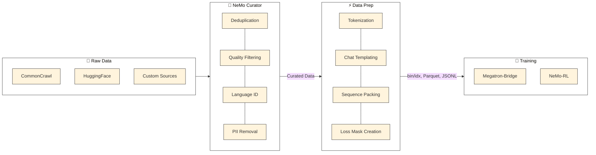

# Data Preparation Module

The `nemotron.data_prep` module handles **last-mile data processing**: transforming curated datasets into training-ready formats. It sits between data curation (handled by [NeMo Curator](https://github.com/NVIDIA-NeMo/Curator)) and model training, producing outputs compatible with the NVIDIA AI training stack.

> **Coming Soon**: Native integration with [NeMo Curator](https://github.com/NVIDIA-NeMo/Curator) for data curation and [NeMo Data Designer](https://github.com/NVIDIA-NeMo/DataDesigner) for synthetic data generation. These integrations will connect raw data sources directly to training-ready format production.

## Overview

Built on [Ray](https://ray.io/), the module provides:

- **Last-mile processing** – convert curated datasets to training-ready formats (tokenization, packing, chat templating)
- **Distributed processing** – scale from a single machine to a cluster of workers using Ray actors
- **Cloud-native I/O** – read from HuggingFace Hub (`hf://`), S3 (`s3://`), GCS (`gs://`), or local paths via fsspec
- **Deterministic output** – frozen shard plans ensure reproducible results across runs
- **Resumable pipelines** – skip completed shards on restart; verify output integrity with checksums

### Data Pipeline: Curator → Data Prep → Training

This module is designed to work alongside [NeMo Curator](https://github.com/NVIDIA-NeMo/Curator) in a two-stage data pipeline:



**Typical workflow:**
1. Use **[NeMo Curator](https://github.com/NVIDIA-NeMo/Curator)** to curate raw data at scale—deduplication, quality filtering, language identification, PII removal
2. Use **Data Prep** to transform curated data into training-ready formats—tokenization, chat templating, sequence packing, loss mask generation

This separation allows you to curate once and prepare data multiple times for different training configurations (different tokenizers, sequence lengths, or output formats).

### Recipe Integration

Each training stage in a recipe includes a dedicated data preparation step that transforms source data into the format required by that stage's training framework:

| Stage | Data Prep Output | Training Framework | Guide |
|-------|------------------|-------------------|-------|
| Stage 0: Pretrain | bin/idx indexed datasets | [Megatron-Bridge](./nvidia-stack.md#megatron-bridge) | [pretrain.md](./nano3/pretrain.md#data-preparation) |
| Stage 1: SFT | Packed Parquet with loss masks | [Megatron-Bridge](./nvidia-stack.md#megatron-bridge) | [sft.md](./nano3/sft.md#data-preparation) |
| Stage 2: RL | JSONL with OpenAI chat format | [NeMo-RL](./nvidia-stack.md#nemo-rl) | [rl.md](./nano3/rl.md#data-preparation) |

Run data preparation for any stage using the [CLI](./cli.md):

```bash
uv run nemotron nano3 data prep pretrain --run YOUR-CLUSTER   # Stage 0
uv run nemotron nano3 data prep sft --run YOUR-CLUSTER        # Stage 1
uv run nemotron nano3 data prep rl --run YOUR-CLUSTER         # Stage 2
```

> **Note**: The `--run YOUR-CLUSTER` flag submits jobs via [NeMo-Run](../nemo_runspec/nemo-run.md). See [Execution through NeMo-Run](../nemo_runspec/nemo-run.md) for setup.

### NeMo-Run Integration

The module integrates natively with [NeMo-Run](../nemo_runspec/nemo-run.md) for job orchestration. Submit data preparation jobs to various executors (Slurm, local, Docker, cloud) directly from your local machine:

```bash
# Submit to Slurm cluster
uv run nemotron nano3 data prep pretrain --run YOUR-CLUSTER

# Run locally with Ray
uv run nemotron nano3 data prep pretrain --run local

# Preview without executing
uv run nemotron nano3 data prep pretrain --run YOUR-CLUSTER --dry-run
```

Configure execution profiles in `env.toml`:

```toml
[YOUR-CLUSTER]
executor = "slurm"
account = "YOUR-ACCOUNT"
partition = "batch"
```

See [Execution through NeMo-Run](../nemo_runspec/nemo-run.md) for complete configuration options.

## Choosing an API

| API | Use When | Output Format |
|-----|----------|---------------|
| `run_pretrain_pipeline()` | Pretraining tokenization | bin/idx |
| `run_sft_pipeline()` | Chat SFT with loss masking | Packed Parquet |

- `run_pretrain_pipeline()` — Standard pretraining tokenization to bin/idx format
- `run_sft_pipeline()` — Chat SFT with role-based loss masking to packed Parquet

**For JSONL output** (RL training):
- Use the stage-specific scripts in `nemotron/recipes/nano3/stage2_rl/data_prep.py`
- Or call `process_jsonl_shard_core()` directly from `nemotron.data_prep.core`

## Supported Output Formats

| Format | Recipe | Output | Use Case |
|--------|--------|--------|----------|
| `binidx` | `run_pretrain_pipeline()` | `.bin/.idx` pairs | Pretraining |
| `packed_parquet` | `run_sft_pipeline()` | `.parquet` files | Chat SFT |
| `jsonl` | Stage scripts | `.jsonl` files | RL training |

## Quick Start

### Pretrain Pipeline (bin/idx)

Tokenize text data to Megatron bin/idx format:

```python
from nemotron.data_prep import DataBlend, run_pretrain_pipeline

blend = DataBlend.load("pretrain_blend.json")
result = run_pretrain_pipeline(
    blend=blend,
    output_dir="./output",
    tokenizer="nvidia/NVIDIA-Nemotron-Nano-9B-v2",
    num_shards=128,
)

print(f"Run hash: {result.run_hash}")
print(f"Total tokens: {result.total_tokens:,}")
print(f"Data paths: {result.data_paths}")
```

### SFT Pipeline (Packed Parquet)

Chat SFT with role-based loss masking to packed Parquet:

```python
from nemotron.data_prep import DataBlend, run_sft_pipeline

blend = DataBlend.load("sft_blend.json")
result = run_sft_pipeline(
    blend=blend,
    output_dir="./output",
    tokenizer="nvidia/NVIDIA-Nemotron-Nano-9B-v2",
    num_shards=64,
    chat_template="nano3",
    pack_size=4096,
)

print(f"Run hash: {result.run_hash}")
print(f"Total sequences: {result.total_sequences:,}")
```


## Output Formats

### BinIdx (Default)

Tokenized binary format for Megatron pretraining:

```python
from nemotron.data_prep.config import BinIdxOutputConfig

config = PipelineConfig(
    tokenizer=TokenizerConfig(model="meta-llama/Llama-3.2-1B"),
    output=OutputConfig(
        dir=Path("./tokenized"),
        format=BinIdxOutputConfig(
            shard_size="256MB",  # Or num_shards=128
            dtype="int32",
        ),
    ),
)
```

### JSONL

Structured JSONL for SFT/RL training (no tokenization):

```python
from nemotron.data_prep.config import JsonlOutputConfig
from nemotron.data_prep.formats.transforms import sft, openai_chat

# SFT format: {"input": "...", "output": "..."}
config = PipelineConfig(
    output=OutputConfig(
        dir=Path("./sft_data"),
        format=JsonlOutputConfig(
            transform=sft(input="instruction", output="response"),
            compression="zstd",  # Optional compression
        ),
    ),
)

# OpenAI chat format: {"messages": [...]}
config = PipelineConfig(
    output=OutputConfig(
        dir=Path("./rl_data"),
        format=JsonlOutputConfig(
            transform=openai_chat(),
        ),
    ),
)
```

### Chat SFT (Packed with Loss Masking)

Chat-templated SFT with role-based loss masking. This format applies chat templates to OpenAI-format messages, tokenizes them, and produces packed Parquet sequences with a loss mask that zeros out system/user tokens:

```python
from nemotron.data_prep import DataBlend, run_sft_pipeline

blend = DataBlend.load("chat_data.json")

result = run_sft_pipeline(
    blend=blend,
    output_dir="./chat_sft",
    tokenizer="nvidia/NVIDIA-Nemotron-Nano-9B-v2",
    num_shards=64,
    chat_template="nano3",       # Built-in template or path to .jinja file
    pack_size=4096,              # Maximum tokens per packed sequence
    algorithm="first_fit_shuffle",
)
```

**Input format** (OpenAI chat messages):
```json
{
  "messages": [
    {"role": "system", "content": "You are a helpful assistant."},
    {"role": "user", "content": "Hello!"},
    {"role": "assistant", "content": "Hi there!"}
  ]
}
```

**Output**:
- `.parquet` files with packed `input_ids` and `loss_mask` arrays
- Loss mask: `0` for system/user tokens, `1` for assistant tokens
- Metadata files for Megatron-Bridge compatibility

## Transforms

Transforms convert input records to the desired output format. They are callables that take a dict and return a dict (or `None` to skip the record).

### Built-in Transform Factories

```python
from nemotron.data_prep.formats.transforms import (
    sft,           # SFT format: {input, output}
    openai_chat,   # OpenAI format: {messages: [...]}
    sharegpt,      # ShareGPT format: {conversations: [...]}
    nemotron_rl,   # Nemotron RL format: {messages, tools}
    passthrough,   # Pass records unchanged
    select,        # Select specific fields
    rename,        # Rename fields
)
```

### sft()

Creates SFT format output:

```python
transform = sft(
    input="instruction",   # Source field for input
    output="response",     # Source field for output
    system="system_prompt" # Optional system prompt field
)

# Input:  {"instruction": "Hello", "response": "Hi!", "system_prompt": "Be helpful"}
# Output: {"input": "Hello", "output": "Hi!", "system": "Be helpful"}
```

### openai_chat()

Creates OpenAI chat format:

```python
transform = openai_chat(messages="conversation")

# Input:  {"conversation": [{"role": "user", "content": "Hi"}]}
# Output: {"messages": [{"role": "user", "content": "Hi"}]}
```

### sharegpt()

Creates ShareGPT format:

```python
transform = sharegpt(conversations="turns")

# Input:  {"turns": [{"from": "human", "value": "Hi"}]}
# Output: {"conversations": [{"from": "human", "value": "Hi"}]}
```

### nemotron_rl()

Extracts messages and tools from Nemotron RL dataset format:

```python
transform = nemotron_rl()

# Input:  {
#   "responses_create_params": {
#     "input": [{"role": "user", "content": "Hi"}],
#     "tools": [{"name": "search", ...}]
#   }
# }
# Output: {"messages": [{"role": "user", "content": "Hi"}], "tools": [...]}
```

Records without valid `responses_create_params.input` are skipped.

### passthrough()

Passes records unchanged:

```python
transform = passthrough()

# Input:  {"any": "data"}
# Output: {"any": "data"}
```

### select()

Selects specific fields:

```python
transform = select("id", "text")

# Input:  {"id": 1, "text": "hello", "extra": "ignored"}
# Output: {"id": 1, "text": "hello"}
```

### rename()

Renames fields:

```python
transform = rename(input="question", output="answer")

# Input:  {"question": "What?", "answer": "This."}
# Output: {"input": "What?", "output": "This."}
```

### Custom Transforms

You can use any callable:

```python
# Lambda
transform = lambda r: {"input": r["q"], "output": r["a"]} if r.get("valid") else None

# Function
def my_transform(record: dict) -> dict | None:
    if len(record.get("text", "")) < 10:
        return None  # Skip short records
    return {"input": record["question"], "output": record["answer"]}
```

### Filtering Records

Return `None` from a transform to skip records. This is useful for filtering out low-quality or malformed data:

```python
def filter_by_length(min_chars: int = 100) -> Transform:
    """Skip records with text shorter than min_chars."""
    def transform(record: dict) -> dict | None:
        text = record.get("text", "")
        if len(text) < min_chars:
            return None  # Record will be skipped
        return record
    return transform

# Usage
config = PipelineConfig(
    output=OutputConfig(
        dir=Path("./filtered"),
        format=JsonlOutputConfig(transform=filter_by_length(min_chars=200)),
    ),
)
```

Built-in transforms also filter: for example, `nemotron_rl()` skips records missing required fields.

## Sharding Configuration

Both `shard_size` and `num_shards` are supported (mutually exclusive):

```python
# Target shard size (default)
format=JsonlOutputConfig(shard_size="256MB")

# Explicit shard count
format=JsonlOutputConfig(num_shards=64)
```

Supported size formats: `"256MB"`, `"1G"`, `"500MiB"`, etc.

## Per-Split Output

Generate separate train/valid/test outputs using `PerSplitConfig`:

```python
from nemotron.data_prep import PerSplitConfig
from nemotron.data_prep.config import PipelineConfig, OutputConfig, BinIdxOutputConfig, TokenizerConfig
from pathlib import Path

config = PipelineConfig(
    tokenizer=TokenizerConfig(model="nvidia/NVIDIA-Nemotron-Nano-9B-v2"),
    output=OutputConfig(
        dir=Path("./output"),
        format=BinIdxOutputConfig(num_shards=64),
    ),
    per_split=PerSplitConfig(
        enabled=True,
        valid_shards=1,   # Number of validation shards
        test_shards=1,    # Number of test shards
    ),
)
```

**Output structure:**
```
output/
├── train/
│   ├── shard_000000.bin
│   ├── shard_000000.idx
│   └── ...
├── valid/
│   └── shard_000000.bin/.idx
├── test/
│   └── shard_000000.bin/.idx
└── blend.json
```

**blend.json format** (per-split mode):
```json
{
  "train": [["1.0", "/path/to/train/shard_000000"], ["1.0", "/path/to/train/shard_000001"]],
  "valid": [["1.0", "/path/to/valid/shard_000000"]],
  "test": [["1.0", "/path/to/test/shard_000000"]]
}
```

This format is directly compatible with Megatron-Bridge's per-split data loading.

## Type Definitions

TypedDicts are provided for type safety:

```python
from nemotron.data_prep.formats.transforms import (
    SftRecord,         # {"input": str, "output": str}
    OpenAIChatRecord,  # {"messages": list[Message]}
    ShareGPTRecord,    # {"conversations": list[Conversation]}
    Message,           # {"role": str, "content": str}
)
```

## API Reference

### Recipe Entry Points

| Function | Description |
|----------|-------------|
| `run_pretrain_pipeline(blend, output_dir, tokenizer, num_shards, ...)` | Tokenize to Megatron bin/idx format |
| `run_sft_pipeline(blend, output_dir, tokenizer, num_shards, ...)` | Chat SFT to packed Parquet format |

### Core Processing Functions

| Function | Description |
|----------|-------------|
| `process_binidx_shard_core(...)` | Tokenize shard to bin/idx (alias: `process_binidx_shard_files_core`) |
| `process_jsonl_shard_core(...)` | Transform and write JSONL records |
| `process_chat_sft_spool_core(...)` | Tokenize chat messages to spool intermediate |
| `process_chat_sft_parquet_core(...)` | Pack spool to Parquet output |

### Configuration Classes

| Class | Description |
|-------|-------------|
| `PipelineConfig` | Pipeline configuration |
| `TokenizerConfig` | Tokenizer settings (model, type, add_bos, add_eos) |
| `OutputConfig` | Output directory and format |
| `BinIdxOutputConfig` | Tokenized binary format options |
| `JsonlOutputConfig` | JSONL format options |
| `ChatSftOutputConfig` | Chat SFT with loss masking options |
| `ObservabilityConfig` | W&B and pipeline logging settings |

### Result Classes

| Class | Description |
|-------|-------------|
| `FormatResult` | Pipeline result with run metadata, data paths, and statistics |
| `DataBlendsArtifact` | Artifact with blend.json path and metrics |

## Compression

JSONL output supports optional zstd compression:

```python
format=JsonlOutputConfig(
    compression="zstd",  # Output .jsonl.zst files
)
```

Requires the `zstandard` package: `uv pip install zstandard`

## Dependencies

Core dependencies:
- `ray` - Parallel processing
- `pyarrow` - Parquet file reading
- `xxhash` - Fast checksums

Optional dependencies:
- `orjson` - Fast JSON serialization (falls back to stdlib json)
- `zstandard` - Zstd compression for JSONL output

## Further Reading

- [NeMo Curator](https://github.com/NVIDIA-NeMo/Curator) – data curation at scale (coming soon)
- [NeMo Data Designer](https://github.com/NVIDIA-NeMo/DataDesigner) – synthetic data generation (coming soon)
- [NVIDIA AI Stack](./nvidia-stack.md) – Megatron-Core, Megatron-Bridge, NeMo-RL
- [Execution through NeMo-Run](../nemo_runspec/nemo-run.md) – job orchestration and execution profiles
- [CLI Framework](./cli.md) – CLI building and recipe commands
- [Artifact Lineage](./artifacts.md) – W&B artifact system and lineage tracking
- [Xenna Observability](./xenna-observability.md) – real-time W&B logging for xenna pipelines
- [Nano3 Recipe](./nano3/README.md) – training recipe example
