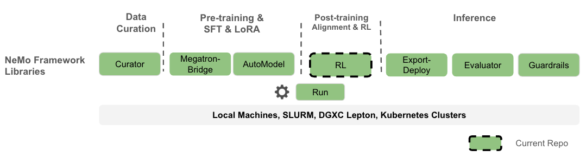
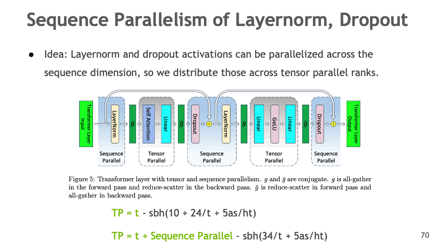
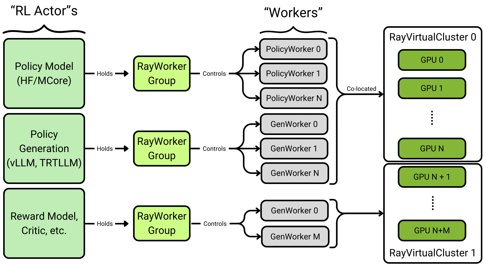

# NVIDIA AI Stack

Nemotron training recipes are built on NVIDIA's AI stack. While `nemotron.kit` handles artifact versioning and lineage tracking and `nemo_runspec` provides the CLI toolkit and execution infrastructure, all heavy-lifting for distributed training is delegated to specialized NVIDIA libraries.

## NeMo Framework

Nemotron recipes are part of the broader NeMo Framework ecosystem, which provides end-to-end tools for the full LLM lifecycle:



*Image credit: [NeMo-RL Documentation](https://docs.nvidia.com/nemo/rl/latest/)*

The Nemotron recipes focus on the **Pre-training & SFT** (via Megatron-Bridge) and **Post-training & RL** (via NeMo-RL) stages, with NeMo-Run orchestrating execution across compute backends.

## Stack Overview

| Component | Purpose | Used In |
|-----------|---------|---------|
| [Megatron-Core](https://github.com/NVIDIA/Megatron-LM) | Distributed training primitives (TP, PP, DP, CP) | All stages |
| [Megatron-Bridge](https://github.com/NVIDIA/Megatron-Bridge) | Model definitions, training loops, HF conversion | Pretrain, SFT |
| [NeMo-RL](https://github.com/NVIDIA/NeMo-RL) | RL algorithms (GRPO, DPO), reward environments | RL stage |

## Megatron-Core

Megatron-Core provides the foundational primitives for efficient large-scale distributed training. It implements the parallelism strategies that enable training models with billions of parameters across thousands of GPUs.

### Parallelism Strategies

Megatron-Core implements multiple parallelism strategies that can be combined for optimal scaling:

#### Tensor Parallelism (TP)

Split model layers across GPUs to handle large weight matrices:


*Image credit: [Megatron-Bridge Documentation](https://docs.nvidia.com/nemo/megatron-bridge/latest/)*

#### Sequence Parallelism (SP)

Distribute LayerNorm and Dropout activations across the sequence dimension:



*Image credit: [Megatron-Bridge Documentation](https://docs.nvidia.com/nemo/megatron-bridge/latest/)*

#### Expert Parallelism (EP)

Distribute MoE experts across GPUs, which is central to Nemotron's sparse MoE architecture:


*Image credit: [Megatron-Bridge Documentation](https://docs.nvidia.com/nemo/megatron-bridge/latest/)*

### All Parallelism Types

| Parallelism | Abbreviation | Description |
|-------------|--------------|-------------|
| Tensor | TP | Split weight matrices across GPUs |
| Pipeline | PP | Split model layers into stages |
| Data | DP | Replicate model, distribute batches |
| Context | CP | Distribute long sequences across GPUs |
| Expert | EP | Distribute MoE experts across GPUs |
| Sequence | SP | Distribute activations in sequence dimension |

### Documentation

- [Megatron-Core GitHub](https://github.com/NVIDIA/Megatron-LM/tree/main/megatron/core)
- [Parallelism Tutorial](https://docs.nvidia.com/nemo-framework/user-guide/latest/nemotoolkit/features/parallelisms.html)

## Megatron-Bridge

Megatron-Bridge is a PyTorch-native library that bridges Hugging Face models with Megatron-Core. It provides production-ready training loops, checkpoint conversion, and pre-configured recipes for 20+ model architectures.

### Features

- **Bidirectional checkpoint conversion** between Hugging Face and Megatron formats
- **Scalable training loop** with all Megatron parallelisms
- **Pre-configured recipes** for Llama, Qwen, DeepSeek, Nemotron, and more
- **Mixed precision** (FP8, BF16, FP4) via Transformer Engine
- **PEFT** with LoRA and DoRA

### How Nemotron Uses It

Nemotron's pretraining and SFT stages use Megatron-Bridge for:

1. **Model definition** via `NemotronHModel` provider for the hybrid Mamba-Transformer architecture
2. **Training loop** with `pretrain()` and `finetune()` entry points
3. **Checkpoint management** with distributed save/load in Megatron format
4. **HF export** to convert trained checkpoints back to Hugging Face format

```python
# Example: Megatron-Bridge training entry point
from megatron.bridge.training import pretrain
from megatron.bridge.recipes.nemotronh import NemotronH4BRecipe

config = NemotronH4BRecipe().config
pretrain(config)
```

### Configuration

Megatron-Bridge uses a central `ConfigContainer` dataclass that combines:

| Section | Purpose |
|---------|---------|
| `model` | Model architecture and parallelism settings |
| `train` | Batch sizes, iterations, gradient accumulation |
| `optimizer` | Optimizer type, learning rate, weight decay |
| `scheduler` | LR schedule (warmup, decay) |
| `dataset` | Data loading configuration |
| `checkpoint` | Save/load intervals and paths |
| `mixed_precision` | FP8/BF16 settings |

### Documentation

- [Megatron-Bridge GitHub](https://github.com/NVIDIA/Megatron-Bridge)
- [Official Documentation](https://docs.nvidia.com/nemo/megatron-bridge/latest/)
- [Training Entry Points](https://docs.nvidia.com/nemo/megatron-bridge/latest/training/entry-points.html)
- [Adding New Models](https://docs.nvidia.com/nemo/megatron-bridge/latest/adding-new-models.html)

## NeMo-RL

NeMo-RL is a post-training library for reinforcement learning on LLMs and VLMs, scaling from single-machine experiments to multi-node deployments.

### Features

- **GRPO** (Group Relative Policy Optimization) – main RL algorithm with clipped policy gradients
- **DAPO** (Dual-Clip Asymmetric Policy Optimization) – extended GRPO with asymmetric clipping
- **DPO** (Direct Preference Optimization) – RL-free alignment from preference data
- **Reward Models** – Bradley-Terry reward model training
- **Multi-Environment Training** – math, code, tool-use, and custom reward environments
- **Flexible Backends** – DTensor (FSDP2) for native PyTorch, Megatron for large models

### How Nemotron Uses It

Nemotron's RL stage uses NeMo-RL for:

1. **GRPO Training** with multi-environment RLVR across 7 reward environments
2. **Generation** via vLLM backend for fast rollouts
3. **Reward Computation** including math verification, code execution, GenRM scoring
4. **Ray Orchestration** for distributed policy-environment coordination

```python
# Example: NeMo-RL GRPO training
from nemo_rl.algorithms.grpo import GRPOConfig, run_grpo

config = GRPOConfig(
    policy_model="nvidia/Nemotron-3-Nano-8B-SFT",
    environments=["math", "code"],
    num_rollouts=32,
)
run_grpo(config)
```

### Architecture

NeMo-RL uses a Ray-based actor model for distributed training. Each "RL Actor" (Policy, Generator, Reward Model) manages a `RayWorkerGroup` that controls multiple workers distributed across GPUs:



*Image credit: [NeMo-RL Documentation](https://docs.nvidia.com/nemo/rl/latest/)*

Core concepts:
- **RL Actors** – high-level components (Policy Model, Generator, Reward Model)
- **RayWorkerGroup** – manages a pool of workers for each actor
- **Workers** – individual processes handling computation
- **RayVirtualCluster** – allocates GPU resources to worker groups

### Reward Environments

NeMo-RL provides several built-in reward environments:

| Environment | Description |
|-------------|-------------|
| `MathEnvironment` | Verifies mathematical solutions |
| `CodeEnvironment` | Executes code in sandbox, checks correctness |
| `RewardModelEnvironment` | Scores responses with trained reward model |
| `ToolEnvironment` | Evaluates tool-use and function calling |
| `NemoGym` | Game environments for multi-turn RL |

### Training Backends

| Backend | Best For | Parallelism |
|---------|----------|-------------|
| **DTensor (FSDP2)** | Models up to ~32B | FSDP, TP, CP, SP |
| **Megatron** | Large models (>100B) | Full 6D parallelism |

Backend selection is automatic based on YAML configuration.

### Documentation

- [NeMo-RL GitHub](https://github.com/NVIDIA/NeMo-RL)
- [Official Documentation](https://docs.nvidia.com/nemo/rl/latest/)
- [GRPO Guide](https://docs.nvidia.com/nemo/rl/latest/guides/grpo.html)
- [Environment Guide](https://docs.nvidia.com/nemo/rl/latest/guides/environments.html)
- [Training Backends](https://docs.nvidia.com/nemo/rl/latest/design-docs/training-backends.html)

## Version Compatibility

Nemotron recipes are tested with specific versions of the NVIDIA AI stack. Check the container images in recipe configs for exact versions.

| Component | Tested Version | Container |
|-----------|----------------|-----------|
| Megatron-Core | 0.13+ | `nvcr.io/nvidia/nemo:*` |
| Megatron-Bridge | 0.2+ | `nvcr.io/nvidia/nemo:*` |
| NeMo-RL | 0.4+ | `nvcr.io/nvidia/nemo-rl:*` |

## Further Reading

- [Nemotron Kit](./kit.md) – artifact system and lineage tracking
- [Execution through NeMo-Run](../nemo_runspec/nemo-run.md) – execution profiles and packagers
- [Nano3 Recipe](./nano3/README.md) – training pipeline
