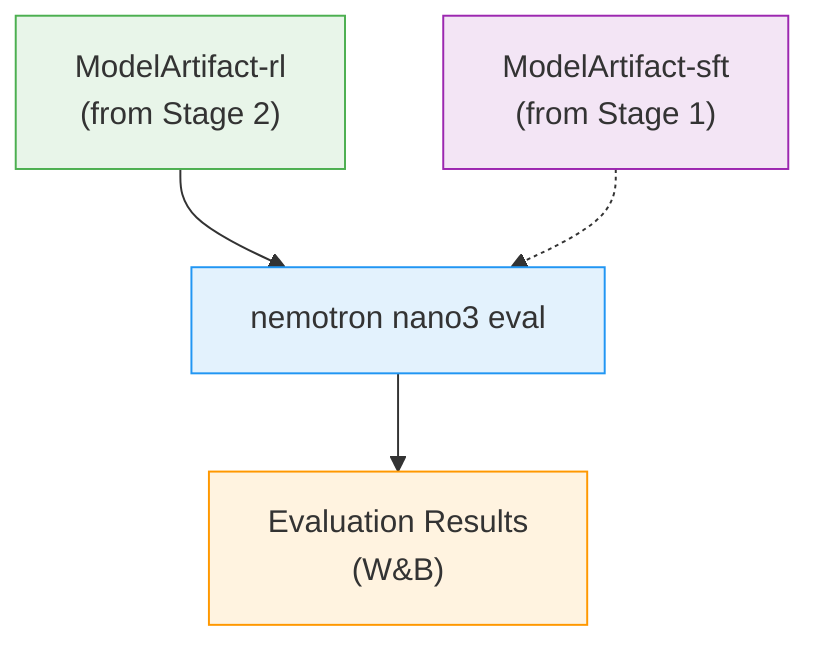

# Stage 3: Evaluation

Evaluate trained Nemotron Nano 3 models using [NeMo Evaluator](https://github.com/NVIDIA-NeMo/Evaluator).

## Overview

This stage evaluates a trained model checkpoint against standard benchmarks using NeMo Framework's Ray-based in-framework deployment. Unlike training stages, there is no recipe script—the CLI compiles the YAML config and passes it directly to [nemo-evaluator-launcher](https://github.com/NVIDIA-NeMo/Evaluator). The config supports `${art:model,path}` to automatically resolve model artifacts from W&B lineage.

| Component | Description |
|-----------|-------------|
| `config/default.yaml` | Evaluation configuration with NeMo Ray deployment and benchmark tasks |

## Quick Start

### Using nemotron CLI (Recommended)

```bash
# Evaluate the RL stage output (default: run.model=rl:latest)
uv run nemotron nano3 eval --run YOUR-CLUSTER

# Evaluate a specific model artifact
uv run nemotron nano3 eval --run YOUR-CLUSTER run.model=sft:v2

# Filter specific tasks
uv run nemotron nano3 eval --run YOUR-CLUSTER -t adlr_mmlu -t hellaswag

# Dry run (preview resolved config)
uv run nemotron nano3 eval --dry-run
```

## How It Works

The evaluation pipeline compiles the YAML config through several steps:

```mermaid
%%{init: {'theme': 'base', 'themeVariables': { 'primaryBorderColor': '#333333', 'lineColor': '#333333', 'primaryTextColor': '#333333'}}}%%
flowchart LR
    yaml["default.yaml"] --> merge["Merge env.toml<br/>+ CLI overrides"]
    merge --> strip["Strip 'run' section<br/>Resolve interpolations"]
    strip --> launcher["nemo-evaluator-launcher<br/>run_eval()"]
    launcher --> deploy["Deploy model<br/>(NeMo Ray)"]
    deploy --> eval["Run benchmarks"]
    eval --> export["Export to W&B"]

    style yaml fill:#e3f2fd,stroke:#2196f3
    style merge fill:#e3f2fd,stroke:#2196f3
    style strip fill:#e3f2fd,stroke:#2196f3
    style launcher fill:#f3e5f5,stroke:#9c27b0
    style deploy fill:#f3e5f5,stroke:#9c27b0
    style eval fill:#f3e5f5,stroke:#9c27b0
    style export fill:#e8f5e9,stroke:#4caf50
```



1. **Load config** — OmegaConf loads `default.yaml` with Hydra defaults
2. **Merge overrides** — env.toml profile values and CLI dotlist overrides are applied
3. **Strip `run` section** — The `run` section (env.toml injection, artifact refs) is removed; `${run.*}` interpolations are resolved into the remaining config
4. **Resolve artifacts** — `${art:model,path}` resolves the model checkpoint path via W&B Artifacts
5. **Call launcher** — The cleaned config is passed to `nemo-evaluator-launcher`'s `run_eval()`
6. **Deploy + Evaluate** — The launcher deploys the model (NeMo Framework Ray), runs benchmarks, and exports results

## Configuration

### Default Config (`config/default.yaml`)

The default config uses NeMo Framework Ray deployment with Slurm execution:

| Section | Key Settings |
|---------|--------------|
| **Execution** | Slurm with 1 node, 8 GPUs, HAProxy load balancing |
| **Deployment** | NeMo Framework Ray with TP=2, EP=8 |
| **Evaluation** | MMLU, ARC Challenge (25-shot), Winogrande (5-shot), HellaSwag, OpenBookQA |
| **Export** | W&B (entity/project from env.toml) |

### Artifact Resolution

The default config uses `${art:model,path}` for the model checkpoint:

```yaml
run:
  model: rl:latest  # Resolve latest RL artifact

deployment:
  checkpoint_path: ${art:model,path}  # Resolved at runtime
```

Override the model artifact on the command line:

```bash
# Evaluate the SFT model instead of RL
uv run nemotron nano3 eval --run YOUR-CLUSTER run.model=sft:latest

# Evaluate a specific version
uv run nemotron nano3 eval --run YOUR-CLUSTER run.model=sft:v2

# Use an explicit path (bypasses artifact resolution)
uv run nemotron nano3 eval --run YOUR-CLUSTER deployment.checkpoint_path=/path/to/checkpoint
```

### Task Filtering

Use `-t`/`--task` flags to run a subset of benchmarks:

```bash
# Single task
uv run nemotron nano3 eval --run YOUR-CLUSTER -t adlr_mmlu

# Multiple tasks
uv run nemotron nano3 eval --run YOUR-CLUSTER -t adlr_mmlu -t hellaswag -t openbookqa
```

Available tasks in the default config: `adlr_mmlu`, `adlr_arc_challenge_llama_25_shot`, `adlr_winogrande_5_shot`, `hellaswag`, `openbookqa`.

### Overrides

```bash
# Increase parallelism
uv run nemotron nano3 eval evaluation.nemo_evaluator_config.config.params.parallelism=16

# Change walltime
uv run nemotron nano3 eval --run YOUR-CLUSTER run.env.time=08:00:00
```

## Execution Options

| Option | Behavior | Use Case |
|--------|----------|----------|
| `--run <profile>` | Attached—submits and waits | Interactive evaluation |
| `--batch <profile>` | Detached—submits and exits | Batch evaluation jobs |
| `--dry-run` | Preview resolved config | Validation |

## W&B Integration

Results are automatically exported to W&B when configured:

```toml
# env.toml
[wandb]
project = "nemotron"
entity = "YOUR-TEAM"
```

The CLI auto-detects your local `wandb login` credentials and propagates them to the evaluation containers. See [W&B Integration](../../../../docs/nemotron/wandb.md) for setup.

## Artifact Lineage



## Previous Stage

- [Stage 2: RL](../stage2_rl/README.md) — Reinforcement learning alignment

## Further Reading

- [NeMo Evaluator](https://github.com/NVIDIA-NeMo/Evaluator) — Upstream project
